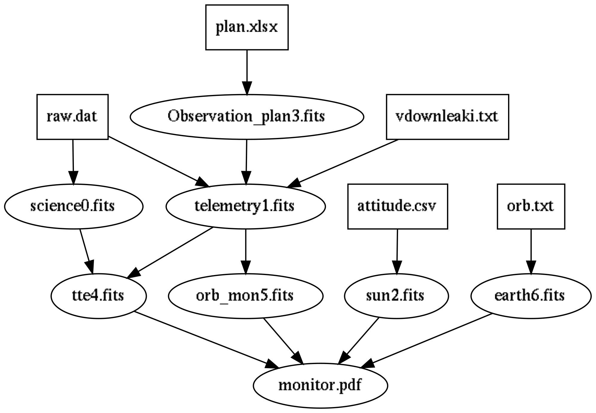
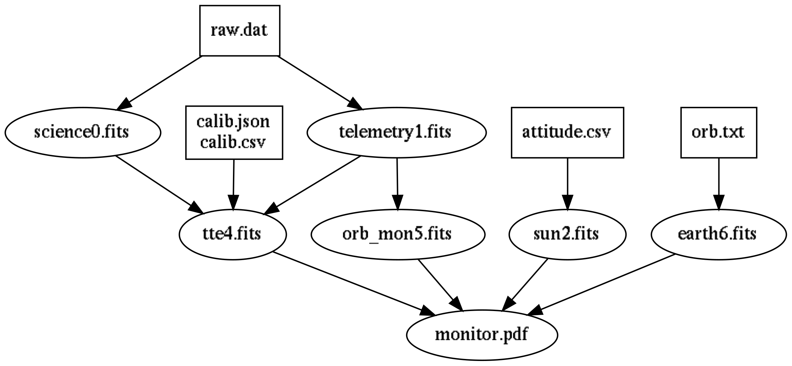

# Introduction

This project is written to help the use of GRID Science Data Products, and is constantly being improved; if you encounter any problems or have suggestions, please contact GRID Team  
In case of content conflict, please refer to the latest version  

### Category
```
srv/pipeline     root  
├─01             satellite 1  
│  ├─fits0       science  
│  ├─fits1       telemetry  
│  ├─fits2       sun  
│  ├─fits3       Observation plan  
│  ├─fits4       tte  
│  ├─fits5       orbit monitor  
│  ├─fits6       earth  
│  ├─log         log  
│  └─picture     data picture  
└─02             satellite 2
```  

### Data Process
##### 01
<div align="center">  
    
</div>

##### 02
<div align="center">  
    
</div>